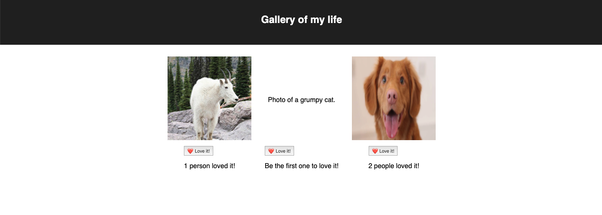

# React Gallery

## Description

Duration: 2 days / weekend challenge

This application allows users to like posts. Built with React, axios, JavaScript, router get and put method.

- every line of code has comment explaining its purpose

## Usage

- When user clicks image, image will be swapped with a description for the image.
- When user clicks 'Love it!' button, number of likes will increase by 1

## Screenshot

